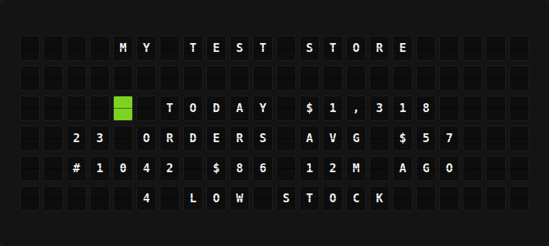

# Shopify Plugin

Show your Shopify store's sales, orders, latest order and low-stock count on your board, with a page that pops up for each new order.



**→ [Setup Guide](./docs/SETUP.md)**

## Overview

The Shopify plugin reads your store through Shopify's GraphQL Admin API (read-only) and turns it into board-ready variables: sales and order count for today, this week or this month, the latest order, and how many products are running low. It can also interrupt the board with a **NEW ORDER** page when an order comes in.

It signs in without a redirect URL, so it works on a board that lives on your home or office network. Use the Client ID and secret of an app from the Shopify Dev Dashboard, or the Admin API access token of a custom app made in the Shopify admin before 2026.

## Template Variables

### Sales

| Variable | Description | Example |
|----------|-------------|---------|
| `{{shopify.sales_line}}` | Period and sales together | `TODAY $1,284` |
| `{{shopify.sales_display}}` | Sales in whole currency units | `$1,284` |
| `{{shopify.sales}}` | Sales as a plain number with cents | `1284.50` |
| `{{shopify.period_label}}` | `TODAY`, `THIS WEEK` or `THIS MONTH` | `TODAY` |
| `{{shopify.orders_line}}` | Order count with `ORDER`/`ORDERS` | `23 ORDERS` |
| `{{shopify.order_count}}` | Number of orders in the period | `23` |
| `{{shopify.avg_order_display}}` | Average order value | `$56` |

### Latest Order

| Variable | Description | Example |
|----------|-------------|---------|
| `{{shopify.last_order_line}}` | Number, total and age together | `#1042 $86 12M AGO` |
| `{{shopify.last_order_number}}` | Order number | `#1042` |
| `{{shopify.last_order_total}}` | Order total | `$86` |
| `{{shopify.last_order_ago}}` | How long ago it was placed | `12M AGO` |

### Inventory

These are empty unless **Low Stock Threshold** is above 0.

| Variable | Description | Example |
|----------|-------------|---------|
| `{{shopify.low_stock_line}}` | `4 LOW STOCK`, or `STOCK OK` | `4 LOW STOCK` |
| `{{shopify.low_stock_count}}` | Variants at or below the threshold | `4` |
| `{{shopify.low_stock_item}}` | The variant with the least stock | `CERAMIC MUG BLUE` |
| `{{shopify.low_stock_item_qty}}` | Units left of that variant | `2` |

### Store

| Variable | Description | Example |
|----------|-------------|---------|
| `{{shopify.store_name}}` | Your store's name | `MY TEST STORE` |
| `{{shopify.currency}}` | Store currency code | `USD` |

Amounts are rounded to whole units. Currencies written with `$` (USD, CAD, AUD, NZD, MXN, SGD, HKD) show `$1,284`. Others show their code (`EUR 1,284`) because the board has no other currency symbols.

## Example Templates

Flagship (center-aligned):

```jinja
{{shopify.store_name}}

{66} {{shopify.sales_line}}
{{shopify.orders_line}} AVG {{shopify.avg_order_display}}
{{shopify.last_order_line}}
{{shopify.low_stock_line}}
```

Note:

```jinja
{66} {{shopify.sales_line}}
{{shopify.orders_line}}
{{shopify.last_order_number}} {{shopify.last_order_ago}}
```

A custom new-order alert page (pick it as the **Alert Page**):

```jinja
{66}{66}{66} NEW ORDER {66}{66}{66}

{{shopify.last_order_number}}
{{shopify.last_order_total}}

{{shopify.sales_line}}
```

## Configuration

| Setting | Type | Required | Default | Description |
|---------|------|----------|---------|-------------|
| `enabled` | boolean | No | `false` | Turn the plugin on |
| `shop_domain` | string | Yes | | Your `.myshopify.com` address |
| `client_id` | string | One auth method | | Dev Dashboard app Client ID |
| `client_secret` | password | One auth method | | Dev Dashboard app Client secret |
| `access_token` | password | One auth method | | Legacy custom app Admin API token (`shpat_...`) |
| `sales_period` | `today` / `week` / `month` | No | `today` | Period for the sales and order totals, in the store's timezone (weeks start Monday) |
| `include_test_orders` | boolean | No | `false` | Count test-gateway orders (turn on for development stores) |
| `low_stock_threshold` | integer | No | `0` | Flag active, tracked variants with this many units or fewer; `0` turns it off |
| `enable_triggers` | boolean | No | `true` | Show an alert page when a new order comes in |
| `alert_duration_seconds` | integer | No | `60` | How long the alert stays on the board |
| `trigger_page_id` | page | No | | Page to show for new orders; blank uses the built-in display |
| `refresh_seconds` | integer | No | `120` | How often to check Shopify (60–3600) |

Every credential can also come from an environment variable: `SHOPIFY_SHOP_DOMAIN`, `SHOPIFY_CLIENT_ID`, `SHOPIFY_CLIENT_SECRET`, `SHOPIFY_ACCESS_TOKEN`.

## Features

- Two sign-in methods that need no redirect URL. With the client credentials grant, the plugin requests a new 24-hour token before the old one expires, and after a 401. Legacy `shpat_` tokens also work.
- Sales and order totals for today, this week or this month, based on the **store's** timezone and correct across daylight saving changes
- Uses each order's current total, after refunds and edits. Cancelled orders are skipped, and so are test orders unless you turn them on.
- Latest order with a short age such as `12M AGO`
- Optional low-stock count and the lowest-stock variant (needs `read_products`)
- New-order alerts that fire once per order and never re-announce old orders after a restart. Several orders arriving together share one `2 NEW ORDERS` alert. The alert fits Flagship and Note boards.
- Waits and retries when Shopify's rate limit is hit. Error messages point to the fix (missing scope, wrong credentials, unknown store).
- All board text is uppercased, accents are folded, and unsupported characters are removed

Requires the `read_orders` scope, and `read_products` for low stock. Without `read_all_orders`, Shopify only returns the last 60 days of orders, which covers every period this plugin shows.

## Author

FiestaBoard Team
